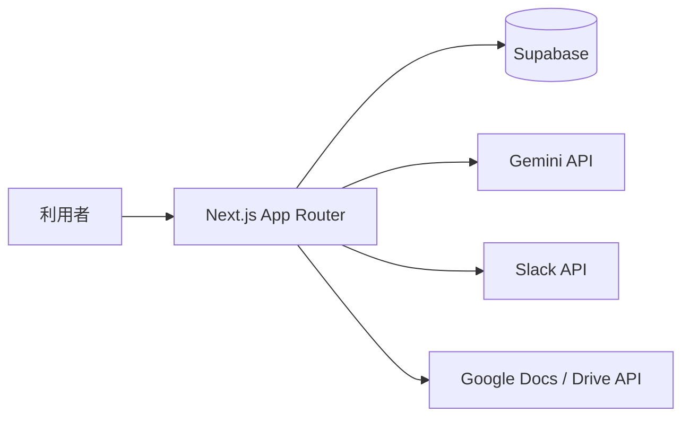

# Tech-Quest

IT コンサル新人研修向けの、課題提出・レビュー・ナレッジ共有プラットフォームです。  
現在のシステムは、`課題管理`、`README 中心の提出`、`AI 一次レビュー`、`メンター評価`、`担当設定`、`匿名ナレッジ公開`、`Slack 通知`、`Google Docs 出力`、`利用状態管理` までを一つにまとめています。

## この README で分かること

- 現在のシステムで何ができるか
- システムがどういう構成で動いているか
- 各ロールで何ができるか
- どのドキュメントを見れば詳細が分かるか

## まず読むドキュメント

- [社内説明用サマリー](docs/internal-brief.md)
- [最終運用ポリシー](docs/final-operational-policy.md)
- [最終運用ポリシー 実装反映チェック](docs/policy-implementation-check.md)
- [システム機能概要](docs/system-feature-overview.md)
- [システム構成](docs/system-structure.md)
- [ロール別にできること](docs/role-capabilities.md)
- [課題一覧 詳細版](docs/task-catalog-detailed.md)

## システムの現在地

Tech-Quest は、次の運用を一連で扱えます。

1. 課題を確認する
2. README とモック画像を提出する
3. Gemini で AI 一次レビューを実行する
4. メンターが採点する
5. 合格提出を匿名ナレッジとして公開する
6. 要件定義書や設計書を Google Docs に出力する
7. 社内説明用サマリーを Google Docs に出力する
8. 合格提出を Google Drive へ長期保管する

## 主要機能

- Google ログインとロール管理
- 利用状態管理 `active / inactive / retired`
- 課題一覧 / 課題詳細
- README + モック画像を中心とした提出
- AI 一次レビュー
- メンター採点
- 受講生単位の担当設定
- 課題ごとの匿名ナレッジ公開
- Slack 通知
- Google Docs 出力
- 合格提出の Google Drive 自動退避

## システム構成の要約

詳しくは [システム構成](docs/system-structure.md) を参照してください。

## ロール別の考え方

### student

- 課題を確認する
- 提出する
- 自分の提出状況と評価を確認する
- ナレッジを見る

### mentor

- 提出をレビューする
- 担当設定を行う
- 合格提出をナレッジ公開する
- 自分でも課題提出できる

### admin

- 課題管理
- ユーザー管理
- 担当設定管理
- Google Docs 出力

詳しくは [ロール別にできること](docs/role-capabilities.md) を参照してください。

## ドキュメント一覧

### システム理解

- [社内説明用サマリー](docs/internal-brief.md)
- [最終運用ポリシー](docs/final-operational-policy.md)
- [最終運用ポリシー 実装反映チェック](docs/policy-implementation-check.md)
- [システム機能概要](docs/system-feature-overview.md)
- [システム構成](docs/system-structure.md)
- [ロール別にできること](docs/role-capabilities.md)
- [課題一覧 詳細版](docs/task-catalog-detailed.md)

### 設計・仕様

- [アーキテクチャ設計](docs/architecture.md)
- [データモデル](docs/data-model.md)
- [API リファレンス](docs/api-reference.md)
- [AI レビュー設計](docs/ai-review-prompting.md)
- [性能とリスク](docs/performance-and-risks.md)

### Google Docs 出力元

- [Google Docs 用 要件定義書](docs/google-docs-requirements-spec.md)
- [Google Docs 用 設計書](docs/google-docs-design-spec.md)
- [Google Docs 用 社内説明サマリー](docs/internal-brief.md)

### セットアップ・運用

- [セットアップ手順](docs/setup.md)
- [詳細手順書](docs/user-setup-handbook.md)

## リポジトリ構成

- `app/`
  画面と API
- `components/`
  UI コンポーネント
- `lib/`
  リポジトリ、認可、外部連携、AI 処理
- `supabase/`
  migration と seed
- `docs/`
  仕様書、運用手順、Google Docs 出力元

## 補足

現在の提出方針では、GitHub リンクは必須にしていません。README とモック画像を中心にレビューし、必要があれば補足リンクを添える運用です。
