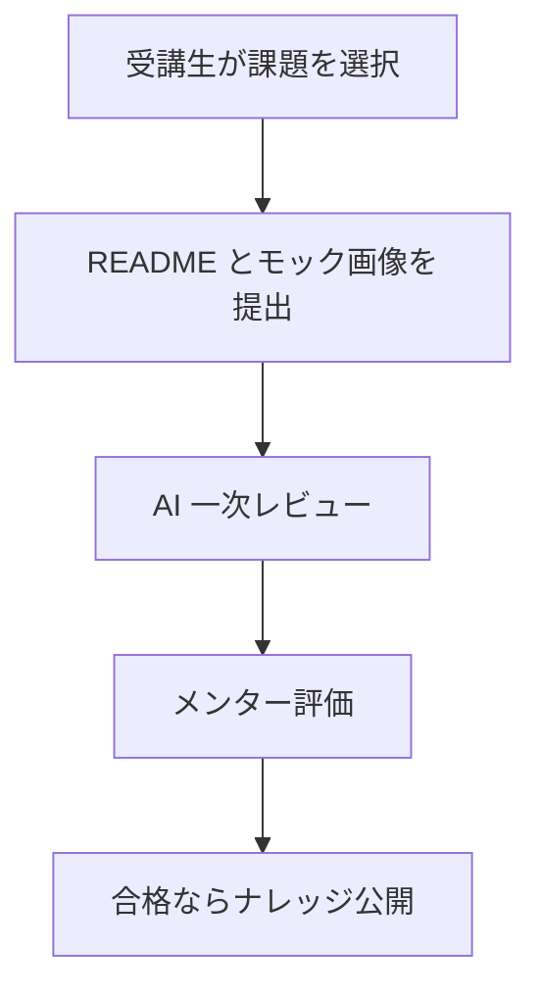
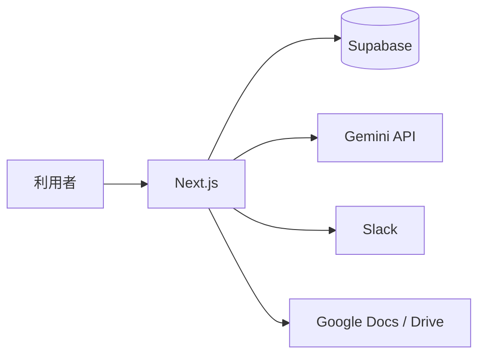

# Tech-Quest 社内説明用サマリー

## 1. これは何か

Tech-Quest は、IT コンサル新人研修で使う `課題提出`、`AI 一次レビュー`、`メンター評価`、`ナレッジ共有` を一つにまとめた研修運用システムです。

これまで分散しがちだった

- 課題の確認
- 提出物の管理
- レビュー
- 良い提出の再利用

を、一つの画面群で回せるようにしています。

## 2. 何が良いのか

- README とモック画像を中心に提出できるため、レビューしやすい
- AI が先に一次チェックするため、メンターの確認ポイントが明確になる
- 合格提出を匿名ナレッジとして再利用できる
- 課題定義や評価基準を管理画面から更新できる
- Slack 通知や Google Docs 出力まで含めて運用をまとめられる

## 3. 誰が使うか

### 受講生

- 課題を選ぶ
- README とモック画像を提出する
- AI レビューとメンター評価を見る
- ナレッジを見て改善する

### メンター

- 提出をレビューする
- 受講生ごとに担当を持つ
- 合格提出をナレッジ化する

### 管理者

- 課題を編集する
- ユーザーのロールを管理する
- 担当設定を管理する
- 要件定義書 / 設計書を Google Docs に出力する

## 4. システムの流れ

## 5. システム構成

## 6. 現在できること

- Google ログイン
- ロール別導線
- 課題一覧 / 課題詳細
- README + モック画像提出
- AI 一次レビュー
- メンター採点
- 受講生単位の担当設定
- 匿名ナレッジ公開
- Slack 通知
- Google Docs 出力

## 7. 提出方針

現在は GitHub を必須にせず、以下を中心に提出します。

- README
- モック画像

これにより、コードの有無に関係なく、要件理解・設計・画面イメージ・業務価値まで含めてレビューしやすくしています。

## 8. 一言でいうと

`研修の提出・評価・学びの再利用を、一つの流れにした運用システム` です。
