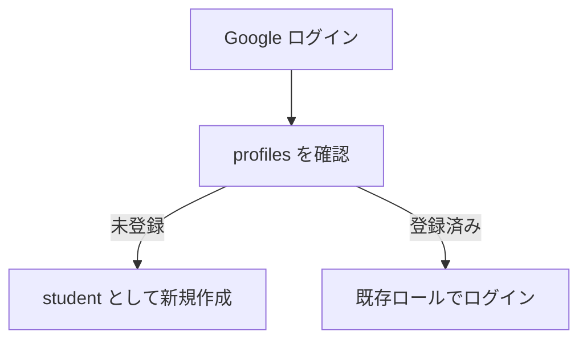

# ロール別にできること

## 1. ロール一覧

Tech-Quest では、ユーザーは以下の 3 ロールで管理します。

- `student`
- `mentor`
- `admin`

初回ログイン時は `student` としてプロフィールが作成されます。

## 2. ロール別の違い

| 機能 | student | mentor | admin |
| --- | --- | --- | --- |
| ログイン | 可 | 可 | 可 |
| 課題一覧の閲覧 | 可 | 可 | 必要に応じて可 |
| 課題詳細の閲覧 | 可 | 可 | 可 |
| 課題提出 | 可 | 可 | 基本想定外 |
| 自分の提出状況の閲覧 | 可 | 可 | 可 |
| AIレビュー実行 | 可 | 可 | 可 |
| メンター評価の保存 | 不可 | 可 | 可 |
| 提出レビュー一覧の閲覧 | 不可 | 可 | 可 |
| 担当設定ページの利用 | 不可 | 可 | 可 |
| 課題管理 | 不可 | 不可 | 可 |
| ユーザー管理 | 不可 | 不可 | 可 |
| Google Docs 出力 | 不可 | 不可 | 可 |
| ナレッジ閲覧 | 可 | 可 | 可 |
| ナレッジ公開 | 不可 | 可 | 可 |

## 3. student のできること

### 主な導線

- `課題一覧`
- `課題提出`
- `提出状況`
- `ナレッジ`

### できること

- 課題一覧を見る
- 課題詳細で合格条件や rubric を確認する
- README とモック画像を提出する
- 自分の提出一覧を見る
- 自分の提出詳細で AI レビューやメンター評価を確認する
- 公開ナレッジを閲覧する

### できないこと

- メンター評価の保存
- 担当設定
- 課題管理
- ユーザー管理

## 4. mentor のできること

### 主な導線

- `課題一覧`
- `課題提出`
- `提出状況`
- `提出レビュー`
- `担当設定`
- `ナレッジ`

### できること

- student と同様に課題提出できる
- 提出レビュー一覧を確認する
- 受講生名で検索して提出を探す
- AI レビューを確認する
- 技術点 / ビジネス点 / 判定 / コメントを保存する
- 受講生単位で自分を担当に設定 / 解除する
- 合格済み提出をナレッジ公開する

### できないこと

- 任意ユーザーのロール変更
- 課題定義そのものの編集
- Google Docs 出力

## 5. admin のできること

### 主な導線

- `提出レビュー`
- `担当設定`
- `課題管理`
- `ユーザー管理`
- `ナレッジ`

### できること

- mentor と同様にレビューできる
- 担当設定を管理できる
- 課題タイトル、概要、合格条件、AI rubric などを編集できる
- ユーザーのロールを変更できる
- Google Docs に要件定義書 / 設計書を出力できる
- ナレッジ公開を管理できる

## 6. 担当設定の考え方

現在の担当設定は `課題単位` ではなく `人単位` です。

- 受講生プロフィールに担当メンターを持つ
- 1 人の受講生に対して担当メンターを設定する
- その受講生の提出全体に担当が紐づく

## 7. 初回ログイン時の挙動

## 8. 運用上のおすすめ

### student

- README を丁寧に書く
- モック画像を必ず添える
- AI レビューの指摘を見てから再提出する

### mentor

- まず担当設定を整理する
- AI レビューを下敷きにして評価する
- 良い提出はナレッジとして匿名公開する

### admin

- 課題定義と評価観点を定期的に更新する
- ロール管理を整理する
- Google Docs 出力を使って社内共有資料を整える
