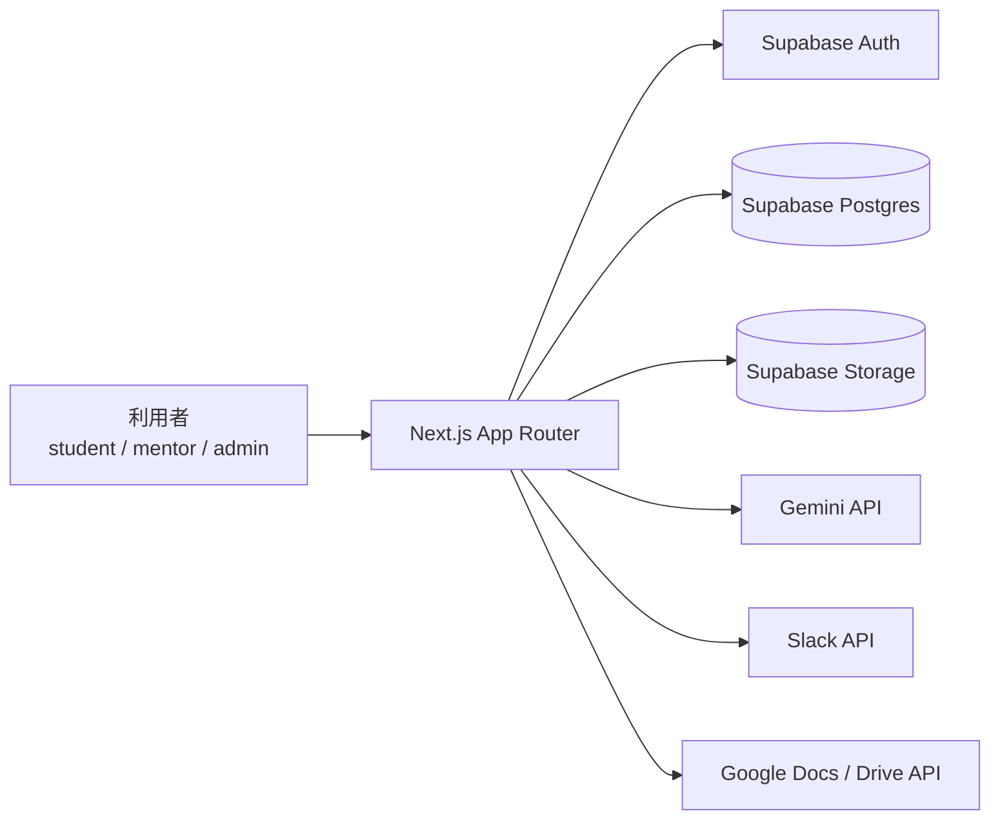
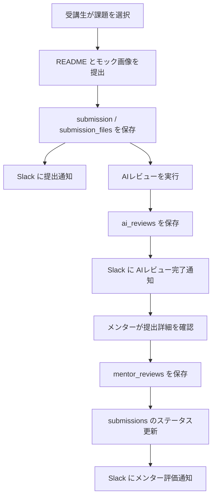
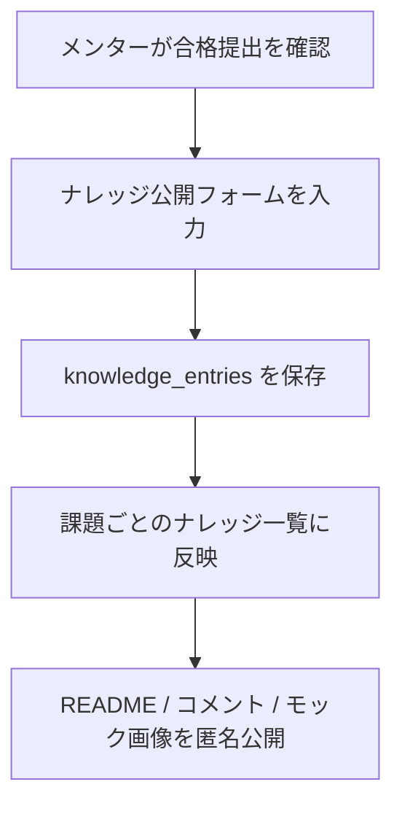
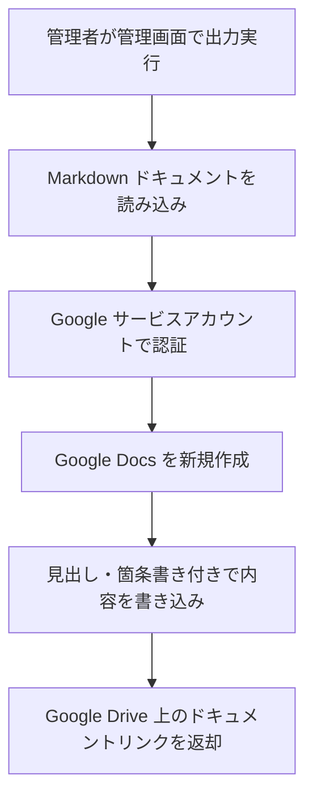
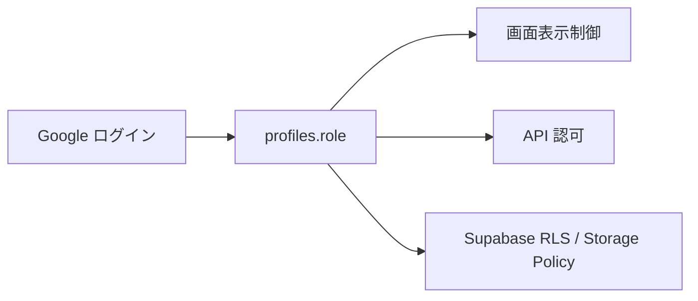

# システム構成

## 1. 全体構成

Tech-Quest は `Next.js` をフロント兼サーバー API 層として使い、`Supabase` を認証・DB・Storage に利用する構成です。AI 一次レビューは `Gemini API`、通知は `Slack API`、文書出力は `Google Docs / Drive API` を利用します。

## 2. 主要フロー

### 2-1. 課題提出からレビュー返却まで

### 2-2. ナレッジ公開フロー

### 2-3. Google Docs 出力フロー

## 3. アプリケーション構成

### フロントエンド

- `app/`
  Next.js App Router の画面と API
- `components/`
  課題、提出、レビュー、ナレッジ、管理 UI 部品

### ドメイン・取得層

- `lib/`
  リポジトリ、認可、AI、Slack、Google Docs 連携
- `types/`
  ドメイン型定義

### インフラ

- `supabase/migrations/`
  DB スキーマと RLS / Storage ポリシー
- `supabase/seed/`
  初期課題データ

## 4. 主なデータ構成

現在のシステムで中心になるテーブルは以下です。

- `profiles`
  ユーザー基本情報、ロール、担当メンター
- `tasks`
  課題定義
- `submissions`
  提出本体
- `submission_files`
  モック画像などの提出ファイル
- `ai_reviews`
  AI 一次レビュー結果
- `mentor_reviews`
  メンター評価結果
- `knowledge_entries`
  ナレッジ公開データ

## 5. 認証・認可の考え方

- ログイン後に `profiles` を同期
- 初回作成時は `student`
- 画面側でロールごとの導線を分岐
- API 側でもロールチェック
- Supabase RLS / Storage Policy で DB 側も制御

## 6. 外部連携

### Gemini API

- README を主入力として一次レビュー
- rubric ベースで要約、スコア、指摘を生成

### Slack API

- 提出登録時
- AI レビュー完了時
- メンター評価保存時

### Google Docs / Drive API

- 要件定義書出力
- 設計書出力

## 7. 現在の実装方針

- README を主提出物にする
- モック画像を必須提出物にする
- GitHub 前提ではなく、レビューしやすい文書中心の運用にする
- 良い提出は課題ごとの匿名ナレッジへ変換する
